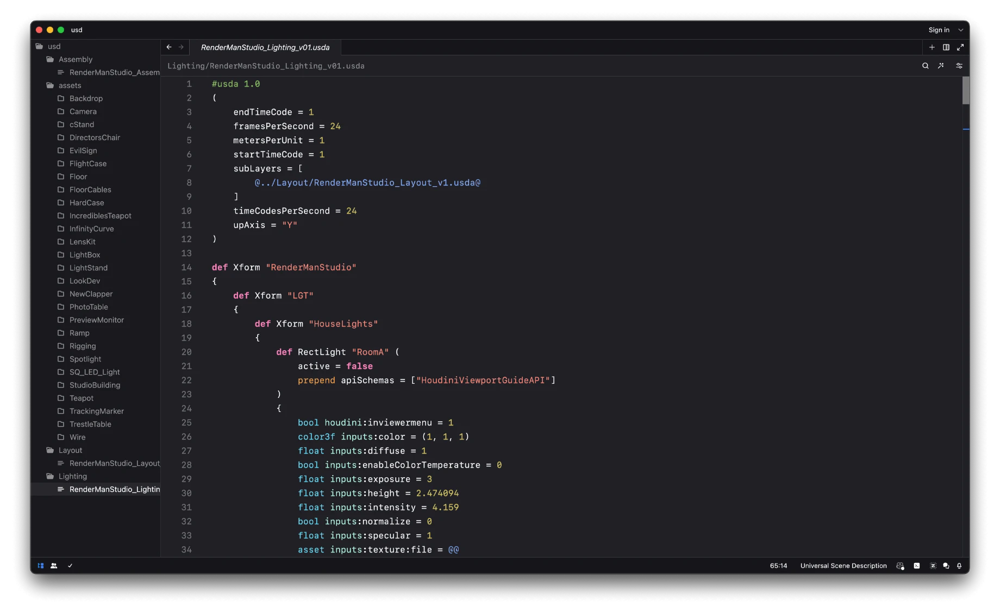

# Universal Scene Description - Zed Editor Extension

This extension introduces basic support for ASCII USD files
through syntax-highlighting thanks to [tree-sitter-usd](https://github.com/ColinKennedy/tree-sitter-usd).

## References

Inspired by [USD Language Extension by Animal Logic](https://github.com/AnimalLogic/AL_usd_vscode_extension) for VSCode.

## Features

- [x] Syntax highlighting,
- [ ] Asset path resolution through `usdresolve`,
- [ ] Support for binary USD files through `usdcat`,
